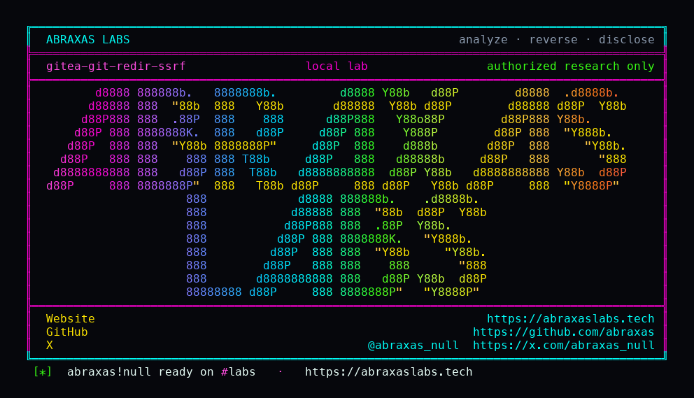

<p align="center">
  
</p>

<p align="center">
  <a href="https://abraxaslabs.tech"><strong>abraxaslabs.tech</strong></a>
  &nbsp;·&nbsp;
  <a href="https://github.com/abraxas">github.com/abraxas</a>
  &nbsp;·&nbsp;
  <a href="https://x.com/abraxas_null">@abraxas_null</a>
  &nbsp;·&nbsp;
  <a href="mailto:abraxas.null@proton.me">abraxas.null@proton.me</a>
  &nbsp;·&nbsp;
  <a href="https://github.com/abraxas/gitea-git-redir-ssrf">gitea-git-redir-ssrf</a>
</p>

# gitea-git-redir-ssrf

**Gitea** `1.27.3` - Gitea

[`IsMigrateURLAllowed`](https://github.com/go-gitea/gitea/blob/v1.27.3/services/migrations/migrate.go) is a **one-shot** `net.LookupIP` on the URL you typed. Bytes then go through `git clone --mirror`. [`HandleGitCmdHTTPRedirection`](https://github.com/go-gitea/gitea/blob/v1.27.3/modules/git/redirection.go) is supposed to stop git from following that hop. It does nothing. The comment is the finding: they left `http.followRedirects=false` off because GitLab 301s without `.git`. Pull-mirror fetch calls the same no-op.

**A signed-in user can migrate from an allow-listed bait host and git follows the 302 into loopback git HTTP. Internal objects land in a repo they own.**

| | |
|---|---|
| ID | no CVE yet |
| CWE | [CWE-918](https://cwe.mitre.org/data/definitions/918.html) |
| CVSS | **High: 7.7** `CVSS:3.1/AV:N/AC:L/PR:L/UI:N/S:C/C:H/I:N/A:N` |
| Product | [Gitea](https://github.com/go-gitea/gitea) |
| Affected | through **v1.27.3** (`146cc3e`) |
| Auth | authenticated (default open registration) |
| License | [GNU Affero GPL v3.0](LICENSE) |
| Lab | `127.0.0.1` only |

## What an attacker can do

Register, migrate from an external-looking URL that 302s to `http://127.0.0.1:.../internal.git`. Direct migrate to loopback is denied. Redirect-followed clone is not. Witness file lands in **their** repo.

Not `file://` disk read. Not `X-Gitea-Internal-Auth` on `/api/internal` (git will not set that header). Not unauthenticated RCE. Not metadata RCE unless you separately show git stored the body.

Same tag leftovers: [keys IDOR](https://github.com/abraxas/gitea-user-keys-idor), [hostmatcher 0.0.0.0/8](https://github.com/abraxas/gitea-hostmatcher-0000-ssrf).

## How I found it

v1.27.3 closed the 2026 GHSA wave: [CVE-2026-60004](https://github.com/go-gitea/gitea/security/advisories/GHSA-rcr6-4jqh-j84m) (`diffpatch` hook RCE, CISA KEV), [CVE-2026-59774](https://github.com/go-gitea/gitea/security/advisories/GHSA-6v53-hr58-556r) (unauth Org-mode `#+INCLUDE`), fork-PR Actions gates, reverse-proxy `X-WEBAUTH-USER` default. Stay on **1.27.3+** for those. I sat on that tag anyway.

CVE-2026-59765 fixed Go `uri.Open`. CVE-2026-22874 fixed Go `reservedIPNets`. Git's redirector is still a FIXME. Changelog "disable HTTP redirects on pull mirror sync" is not this function.

Lab puts Gitea on `8.8.4.2` so a bait host at `8.8.4.10` looks **external** to hostmatcher. Internal git HTTP binds **loopback only** on the Gitea netns (`network_mode: service:gitea`, port 9418). Direct migrate to `127.0.0.1` must fail. Redirect-followed clone must succeed. `redir.py` 302s `/bait.git` to `http://127.0.0.1:9418/internal.git`. Witness file `WITNESS` contains `GHSA-GITEA-GIT-REDIR-SSRF`.

Wrong turns already recorded: `ALLOW_LOCALNETWORKS true` (then the allow-list is gone); `file://`; `X-Gitea-Internal-Auth`; a reverse shell. Theatre. Direct loopback migrate denied is the control.

Client bugs look like product bugs. A helper that shadows `http.client` never sends a packet. `.recv()` on an `HTTPResponse` is not `.read()`. I mention that once because it cost time and looked, for a minute, like 1.27.3 had finished the job.

## Lab

```bash
cd lab
./run.sh
```

Target **only** `http://127.0.0.1:18103`. `ALLOW_LOCALNETWORKS=false`.

```text
negative-loopback status=422 You can not import from disallowed hosts
migrate-bait status=201 clone_addr=http://8.8.4.10/bait.git
fetch raw/WITNESS status=200 GHSA-GITEA-GIT-REDIR-SSRF
SUCCESS Gitea #2 git HTTP redirect SSRF
```

## The fix

Do not treat submit-time DNS as the boundary. Force `http.followRedirects=false` (and normalize clone URLs to `.git` so GitLab still works), or proxy git HTTP through a dialer that re-runs `hostmatcher` on every hop.

## References

- [github.com/go-gitea/gitea](https://github.com/go-gitea/gitea) tag [v1.27.3](https://github.com/go-gitea/gitea/releases/tag/v1.27.3)
- [`HandleGitCmdHTTPRedirection`](https://github.com/go-gitea/gitea/blob/v1.27.3/modules/git/redirection.go) · [`IsMigrateURLAllowed`](https://github.com/go-gitea/gitea/blob/v1.27.3/services/migrations/migrate.go)
- Nearby patched: [CVE-2026-59765](https://github.com/go-gitea/gitea/security/advisories/GHSA-2wm4-vwp6-v7xc) · [CVE-2026-22874](https://github.com/go-gitea/gitea/security/advisories/GHSA-2r5c-gw76-rh3w)
- [CWE-918](https://cwe.mitre.org/data/definitions/918.html)

## License

GNU Affero GPL v3.0. See [LICENSE](LICENSE). Loopback lab only. No warranty.
